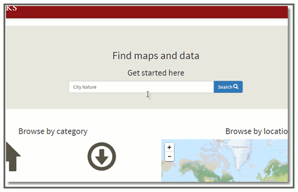

#Hacking [EarthWorks.stanford.edu](http://earthworks.stanford.edu): 

##A Tutorial for those who would like to use geodata from the Stanford Digital Repository in web map applications

  
This tutorial is designed as a quick "getting started" guide for anyone who wants to use geospatial data served from the [**Stanford Digital Repository (SDR)**](https://sdr.stanford.edu/) in data-driven applications, like web maps! The hope is that by demonstrating how applications can be driven directly from data held in the [**SDR**](https://sdr.stanford.edu/), Stanford faculty, staff and student researchers will be encouraged to deposit the geospatial datasets that result from their research.

This tutorial will demonstrate how to make use of data that is discoverable through the [**EarthWorks**](http://earthworks.stanford.edu) data discovery application, specifically. One of the advantages of depositing data into the [**SDR**](https://sdr.stanford.edu/) for discovery in [**EarthWorks**](http://earthworks.stanford.edu) is that the data is then served throught the **Stanford Spatial Data Infrastructure (SSDI)**, which is an highly performant geospatial stack based upon the [**OpenGeo Suite**](http://boundlessgeo.com/solutions/opengeo-suite/). The requirements of the  [**EarthWorks**](http://earthworks.stanford.edu) applications (spatial search, data display, attribute query, etc...) are driven by the **SSDI**'s [**OGC**](http://www.opengeospatial.org/) compliant web services (WMS, WFS, etc...), with the added bonus that these services can be leveraged in any other platform that supports them. 

 I'll be demonstrating how you can create a web map with the web mapping service [CartoDB.com](http://cartodb.com), but you should keep in mind that the same [**OGC**](http://www.opengeospatial.org/) compliant web service endpoints can be used in any other applications that support them, including [**ArcGIS Online**](http://arcgis.com), [**Leaflet.js**](http://leafletjs.com/), [**QGIS**](http://qgis.org/en/site/), [**MapBox**](https://www.mapbox.com/) and others.

###Finding Data in [EarthWorks](http://earthworks.stanford.edu)

Finding data in EarthWorks is pretty intuitive. It's a single search box interface, so you can just enter what you are interested in, there, or you can use the facets on the left side of the panel to begin drilling down into the holding. Of course, if you are looking for a particular area, you can also just zoom to that area in the map and click **Search here**. I won't spend too much time going into searching for data in [EarthWorks](http://earthworks.stanford.edu), since that's not what this tutorial is about. Instead, I'm just gong to focus on a dataset developed by the [**City Nature**](http://citynature.stanford.edu) project.

* Type '**City Nature**' into the [**EarthWorks**](http://earthworks.stanford.edu) **search box** and click on the **Search** button.

 

